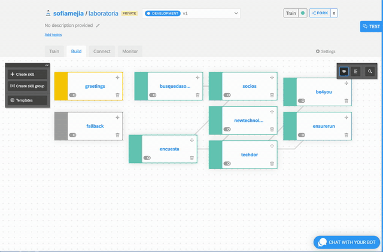
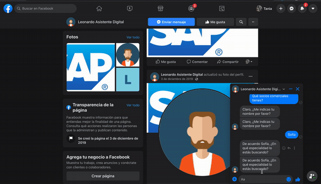

# SAP DIGITAL ASSISTANT

Este repositorio contiene la documentación del chatbot que fue credo para el reto que SAP propuso para Talent Fest de [Laboratoria](https://www.laboratoria.la/) que se llevo acabo en Diciembre de 2019.

Mi participación en este proyecto fue mayoritariamente enfocada a la creación y desarrollo de Leo el asistente virtual.

### Bases del reto:

Para la siguiente evaluación se debe realizar un portal de colaboración para socios de negocio de SAP usando el servicio de Portal de la plataforma SAP Cloud Platform bajo el ambiente de Neo, que tenga expuesta información relevante de diferentes socios de negocio.

Adicionalmente, se debe crear un Asistente Digital (chatbot) usando el servicio de SAP Conversational AI que permita la consulta rápida de especialización, industria, cantidad de consultores, contactos y socios comerciales disponibles, donde dicho asistente digital esté integrado al portal previamente creaado.

### Creación del asistente virtual en la consola de SAP Conversational AI

### Integración a Facebook

### Resultado 

[Aquí](https://drive.google.com/file/d/1nqTdPvp8I0qgPhjo9U5VdfdI05ubgGaM/view?usp=sharing) se puede ver la presentación del proyecto finalizado.

